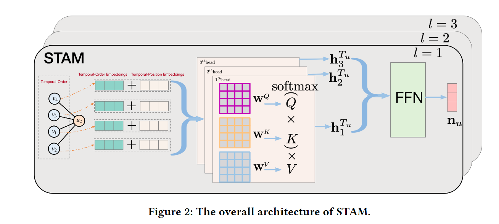

利用时空聚合方法与图神经网络推荐方法的结合，超越LightGCN?

    

图神经网络推荐系统的关键核心就是制造邻居的embedding learning，之前的工作都聚焦于空间上的聚合，但是时空上的研究还是比较少，STAM采用Scaled-Dot-Product Attention去one-hop的时空顺序，采用多头注意力机制去进行joint attention在不同的隐藏子空间，本文的实验表明，时空聚合方法在MRR@20指标上MovieLens上超越24%，Amazon上超越8%，淘宝上超过13%。
Mac～～
<!--more-->

疑问： 图序列推荐不是也包含了时间信息么，两者有什么区别呢？

在这个论文里面我们跟Lightgcn一样，也省去了非线性变换，从以往的基于空间的聚合的方法来说，用两个人来举例，如果他们交互的物品都一样，那么他们都会得到同样的推荐商品，但是如果基于我们的时空聚合的方法来说，就算推荐的东西一样，但是点击顺序不一样，系统所推荐的东西便不一样。

这个文章的比较对象是**序列推荐**，以及其他基于空间上聚合的GNN模型。

## 2.基于GNN的推荐的介绍

2.1 Embedding layer 

用处就是讲one-hot 表示进行一个到低维稠密的向量上，起到一个初始化的作用，其数值还能通过聚合和传播进行更新。

2.2 embedding aggregation layer

这个主要是负责聚合领域信息，在user-item图中，一共有两种聚合操作，item聚合和user聚合，

2.3 embedding propagation layer

也是分两步，先聚合邻居点，然后把邻居点和自己的embedding输入一个update函数，进行更新。

$$
\begin{aligned}
&\mathbf{n}_{u}^{(l+1)}=f_{u \leftarrow v}\left(\mathbf{h}_{v}^{(l)} \mid v \in \mathcal{N}_{u}\right) \\
&\mathbf{h}_{u}^{(l+1)}=g\left(\mathbf{n}_{u}^{(l+1)}, \mathbf{h}_{u}^{(l)}\right)
\end{aligned}
$$

2.4 prediction layer

先是将l层的u节点的邻居v的embedding融合成一个l+1层的一个固定长度的vector n，然后再将n与l层的u进行一个update的操作。
$$
\begin{aligned}
&\mathbf{e}_{u}^{*}=o\left(\mathbf{h}_{u}^{(1)}, \cdots, \mathbf{h}_{u}^{(L)}\right) \\
&\mathbf{e}_{v}^{*}=o\left(\mathbf{h}_{v}^{(1)}, \cdots, \mathbf{h}_{v}^{(L)}\right)
\end{aligned}
$$

## STAM的架构

